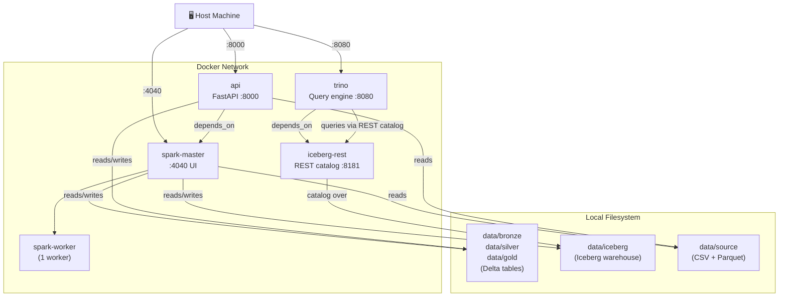
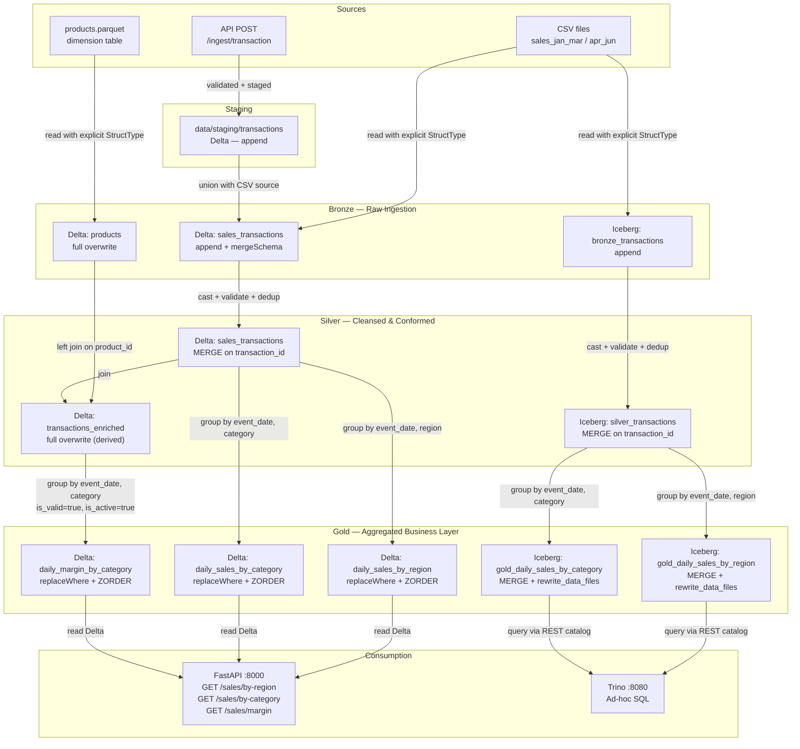

# Delta Lake + Iceberg Retail Sales Pipeline

A local **medallion architecture** pipeline built with PySpark, running in Docker. Ingests retail sales CSV files and processes them through bronze, silver, and gold layers — writing to **both Delta Lake and Apache Iceberg simultaneously** on every run. Gold tables are queryable via a **FastAPI REST service** or directly through **Trino** for ad-hoc SQL without PySpark.

Built as a portfolio project to demonstrate modern data lakehouse patterns — designed to be extended to cloud storage (ADLS, S3) or Databricks with minimal changes.

---

## Architecture

```
CSV Files  ──────────────────────────────────────────────────────────────►  Bronze (raw)
Products Parquet ──────────────────────────────────────────────────────►  Bronze Products
API POST /ingest/transaction ──► Staging (Delta) ──────────────────────►  Bronze (unioned)

Bronze ──────────────────────────────────────────────────────────────────►  Silver (cleansed)
Bronze Products + Silver ────────────────────────────────────────────────►  Silver Enriched

Silver ──────────────────────────────────────────────────────────────────►  Gold: by_region
                                                                         ►  Gold: by_category
Silver Enriched ─────────────────────────────────────────────────────────►  Gold: margin

Gold tables ─────────────────────────────────────────────────────────────►  FastAPI :8000
                                                                         ►  iceberg-rest :8181
                                                                                  │
                                                                         ►  Trino :8080
```

Both Delta and Iceberg formats run in parallel on every pipeline execution. The FastAPI service exposes gold tables as JSON endpoints and accepts new transactions via a staging table that feeds into the next pipeline run.

| Layer | Description | Delta pattern | Iceberg pattern |
| --- | --- | --- | --- |
| **Bronze** | Raw ingestion, metadata added, no transforms | Append + `mergeSchema` | `writeTo().create()` / `.append()` |
| **Bronze Products** | Dimension table (full overwrite each run) | Full overwrite | — (Delta only) |
| **Silver** | Typed, deduplicated, validated, upserted | `MERGE INTO` on `transaction_id` | SQL `MERGE INTO` on `transaction_id` |
| **Silver Enriched** | Silver joined with products dimension | Full overwrite (derived) | — (Delta only) |
| **Gold** | Business aggregations, query-optimised | `replaceWhere` + ZORDER | SQL `MERGE INTO` + `rewrite_data_files` |

---

## Technical Infrastructure

The pipeline runs across 5 Docker services that share a local filesystem volume for all table data.



---

## ETL / ELT Data Flow

Delta Lake and Iceberg run as parallel write tracks on every pipeline execution. FastAPI serves Delta gold; Trino queries Iceberg gold.



---

## Pipeline Layers

### Bronze — Raw Ingestion

* Reads all CSVs from `data/source/` using explicit `StructType` (no `inferSchema`)
* Unions rows from the API staging table (`data/staging/transactions/`) if present
* Adds `_ingested_at`, `_source_file`, `ingestion_date` (partition key)
* Products parquet read with explicit `PRODUCTS_SCHEMA`; written as full-overwrite Delta dimension

### Silver — Cleansed & Conformed

* Casts `event_date` from string → `DateType`
* Flags `_is_valid = false` where `customer_id` is null/empty or `total_amount ≤ 0`
* Deduplicates by `transaction_id`, keeping the row with the latest `_ingested_at`
* MERGE upsert on `transaction_id` (Delta API / SQL MERGE for Iceberg)
* **Silver Enriched**: left-joins silver transactions with bronze products on `product_id`, adding `supplier`, `cost_price`, `is_active`

### Gold — Aggregated Business Layer

**`daily_sales_by_region`** — grouped by `event_date` + `region`

```
total_revenue | total_transactions | total_units | avg_discount_pct
```

**`daily_sales_by_category`** — grouped by `event_date` + `category`

```
total_revenue | total_transactions | total_units | avg_unit_price
```

**`daily_margin_by_category`** — from enriched silver, `_is_valid = true AND is_active = true`

```
total_revenue | total_cost | gross_margin | margin_pct
```

Delta gold tables use `replaceWhere` + ZORDER. Iceberg gold tables use SQL `MERGE INTO` with composite keys and `rewrite_data_files` for compaction. The margin table is Delta-only.

---

## FastAPI Service

A REST API (port 8000) backed by the same SparkSession as the pipeline.

| Endpoint | Description |
| --- | --- |
| `POST /ingest/transaction` | Validate and stage a new transaction to the Delta staging table |
| `GET /sales/by-region` | Query `daily_sales_by_region` gold table with date range filter |
| `GET /sales/by-category` | Query `daily_sales_by_category` gold table with date range filter |
| `GET /sales/margin` | Query `daily_margin_by_category` gold table with date range filter |
| `GET /health` | Check all three gold tables exist and are readable |

Staged transactions are picked up on the next `python run_pipeline.py` run and flow through bronze → silver → gold automatically.

```bash
# Health check
curl http://localhost:8000/health

# Query gold (default: last 30 days)
curl "http://localhost:8000/sales/by-region?start_date=2024-01-01&end_date=2024-06-30"
curl "http://localhost:8000/sales/margin?start_date=2024-01-01&end_date=2024-06-30"

# Stage a new transaction
curl -X POST http://localhost:8000/ingest/transaction \
  -H "Content-Type: application/json" \
  -d '{
    "transaction_id": "TXN999999",
    "event_date": "2024-07-01",
    "store_id": "S001",
    "region": "North",
    "customer_id": "C0001",
    "product_id": "P001",
    "product_name": "Laptop Pro 15",
    "category": "Electronics",
    "quantity": 2,
    "unit_price": 1299.99,
    "discount_pct": 10,
    "discount_amount": 259.99,
    "total_amount": 2339.99,
    "payment_method": "Credit Card"
  }'

# Then re-run the pipeline to promote it through all layers
docker compose exec spark-master python run_pipeline.py

# Interactive API docs
open http://localhost:8000/docs
```

---

## Dataset

Two CSV files simulating incremental batch loads of retail sales transactions:

| File | Rows | Period |
| --- | --- | --- |
| `sales_jan_mar_2024.csv` | 1,000 | Jan – Mar 2024 |
| `sales_apr_jun_2024.csv` | 1,000 | Apr – Jun 2024 |

Plus a generated products dimension file:

| File | Rows | Contents |
| --- | --- | --- |
| `products.parquet` | 10 | P001–P010 with supplier, cost\_price, is\_active |

**Known data quality issues** (handled in Silver):

* ~2% of rows have empty `customer_id` → flagged `_is_valid = false`
* ~1% of rows have negative `total_amount` → flagged `_is_valid = false`

---

## Stack

| Component | Version |
| --- | --- |
| Python | 3.11 |
| PySpark | 3.5.0 |
| delta-spark | 3.2.0 |
| iceberg-spark-runtime | 1.5.2 |
| FastAPI | 0.115.0 |
| Uvicorn | 0.30.0 |
| Trino | 435 |
| iceberg-rest (REST catalog bridge) | tabulario/iceberg-rest:latest |
| Java | 17 (OpenJDK) |
| Docker base image | `python:3.11-slim-bookworm` |
| Testing | pytest 7.4 + chispa |

---

## Project Structure

```
├── Dockerfile                        # spark-master / spark-worker image
├── Dockerfile.api                    # FastAPI service image
├── docker-compose.yml                # 5 services: spark-master, spark-worker, api, iceberg-rest, trino
├── requirements.txt                  # Spark container deps (includes fastapi for tests)
├── requirements-api.txt              # API container deps
├── run_pipeline.py                   # 8-step orchestrator
├── scripts/
│   └── generate_products_parquet.py  # Generates data/source/products.parquet
├── trino/
│   └── etc/catalog/
│       └── iceberg.properties        # REST catalog → iceberg-rest:8181
├── data/
│   ├── source/                       # Input CSVs + products.parquet
│   ├── staging/                      # API-submitted transactions (Delta, gitignored)
│   ├── bronze/                       # Raw Delta tables (gitignored)
│   ├── silver/                       # Cleansed Delta tables (gitignored)
│   ├── gold/                         # Aggregated Delta tables (gitignored)
│   └── iceberg/                      # Iceberg warehouse (gitignored)
├── src/
│   ├── config.py                     # SparkSession singleton + all path constants
│   ├── ingestion/
│   │   ├── bronze_ingest.py          # CSV + staging → bronze (Delta + Iceberg)
│   │   └── bronze_products.py        # Products parquet → bronze Delta (full overwrite)
│   ├── transformations/
│   │   ├── silver_transform.py       # transform_silver() + enrich_silver_with_products()
│   │   └── gold_aggregate.py         # aggregate_gold() + aggregate_gold_margin()
│   └── utils/
│       ├── delta_utils.py            # merge_into_delta, optimize_table, vacuum_table
│       ├── iceberg_utils.py          # iceberg_table_exists, merge_into_iceberg, optimize_iceberg_table
│       └── schema_utils.py           # All StructType schemas
├── api/
│   ├── main.py                       # FastAPI app + lifespan SparkSession
│   ├── dependencies.py               # get_spark() → singleton
│   ├── routers/
│   │   ├── ingest.py                 # POST /ingest/transaction
│   │   └── sales.py                  # GET /sales/* + GET /health
│   └── models/
│       └── schemas.py                # Pydantic models
└── tests/
    ├── conftest.py                   # Session-scoped SparkSession fixture
    ├── test_bronze.py                # (6 tests)
    ├── test_silver.py                # (6 tests)
    ├── test_gold.py                  # (6 tests)
    ├── test_e2e_incremental.py       # (1 test)
    ├── test_iceberg.py               # (12 tests)
    ├── test_products.py              # (12 tests)
    └── test_api.py                   # (12 tests)
```

---

## Quick Start

**Prerequisites:** Docker and Docker Compose.

```bash
# 1. Clone
git clone https://github.com/ericreitsma13-star/delta-lake-retail-pipeline.git
cd delta-lake-retail-pipeline

# 2. Build and start all 5 containers
docker compose up -d --build

# 3. Generate the products dimension file
docker compose exec spark-master python scripts/generate_products_parquet.py

# 4. Run the full pipeline
docker compose exec spark-master python run_pipeline.py

# 5. Run tests
docker compose exec spark-master pytest tests/ -v

# 6. API docs
open http://localhost:8000/docs
```

---

## Ad-hoc SQL with Trino

After running the pipeline, Iceberg gold tables are queryable via Trino at `localhost:8080`:

```sql
docker compose exec trino trino

-- Inside the CLI:
SHOW TABLES FROM iceberg.retail;

SELECT * FROM iceberg.retail.gold_daily_sales_by_region
ORDER BY event_date, region LIMIT 10;

SELECT region, SUM(total_revenue) AS revenue
FROM iceberg.retail.gold_daily_sales_by_region
GROUP BY region ORDER BY revenue DESC;

SELECT category, SUM(total_revenue) AS revenue, AVG(avg_unit_price) AS avg_price
FROM iceberg.retail.gold_daily_sales_by_category
GROUP BY category ORDER BY revenue DESC;
```

---

## Tests

55 tests covering all layers in both formats, plus API and product dimension tests.

```
test_bronze.py          (6 tests)  — metadata columns, null checks, row counts, Delta write/read
test_silver.py          (6 tests)  — validation flags, date casting, deduplication, MERGE insert/update
test_gold.py            (6 tests)  — aggregation correctness, valid-row filtering, Delta write/read
test_e2e_incremental.py (1 test)   — two-batch incremental load + idempotency across all layers
test_iceberg.py         (12 tests) — Bronze write/append, Silver validation/dedup/MERGE, Gold aggregation/upsert
test_products.py        (12 tests) — Bronze products ingestion, silver enrichment join, gold margin calculation
test_api.py             (12 tests) — POST validation, GET endpoints, health check
```

```bash
docker compose exec spark-master pytest tests/ -v --tb=short
```

---

## Key Design Decisions

* **`configure_spark_with_delta_pip`** — required when using pip-installed `delta-spark` to put Delta JARs on the classpath. The `extra_packages` argument pulls the Iceberg runtime JAR from Maven at the same time.
* **Named Iceberg catalog** — `spark_catalog` is claimed by `DeltaCatalog`. Iceberg runs in a separate named catalog (`iceberg`, hadoop type); tables referenced as `iceberg.retail.<name>`.
* **Explicit `StructType` everywhere** — `inferSchema=True` is never used; all schemas live in `schema_utils.py`.
* **FastAPI lifespan SparkSession** — Spark is initialised once at startup; `get_spark_session()` returns the same singleton for every request.
* **Staging table union** — `ingest_bronze()` checks whether a staging Delta table exists and unions it with the CSV source before adding metadata.
* **API tests use monkeypatching** — route handlers access paths via `import src.config as config; config.GOLD_REGION_PATH` so `monkeypatch.setattr(config, ...)` works at call time with `tmp_path` Delta tables.
* **`replaceWhere` for Delta gold; SQL MERGE for Iceberg gold** — `replaceWhere` is a Delta-only API. Iceberg achieves the same partition-safe update via `MERGE INTO` with composite keys.

---

## Extending This Project

* **Cloud storage** — swap local paths in `src/config.py` for `abfss://` (ADLS) or `s3a://` (S3)
* **Databricks** — replace the SparkSession factory with `DatabricksSession.builder.getOrCreate()` and use Unity Catalog for Iceberg
* **Orchestration** — wrap each layer in an Airflow DAG or Databricks Workflow task
* **Streaming** — replace `spark.read.csv()` in bronze with `spark.readStream` for near-real-time ingestion
* **SCD Type 2** — extend the silver MERGE to track row history instead of overwriting matched rows
* **BI / dashboards** — connect any JDBC-compatible tool (DBeaver, Metabase, Superset) to Trino at `localhost:8080`

---

## About This Project

This project came out of wanting to consolidate and demonstrate a range of modern data engineering patterns in a single working codebase — medallion architecture, open table formats, a REST ingestion layer, and ad-hoc SQL, all running locally in Docker. I designed the architecture, defined the layer specifications and schema decisions, and tested and validated the output throughout. Claude Code in agentic mode handled the implementation, which let me stay focused on the design, the technical tradeoffs, and making sure everything actually worked end to end.

---

## Built With Claude Code

This project was scaffolded end-to-end using [Claude Code](https://claude.ai/code) in agentic mode — from a `CLAUDE.md` specification through to a working, tested, and committed pipeline.
